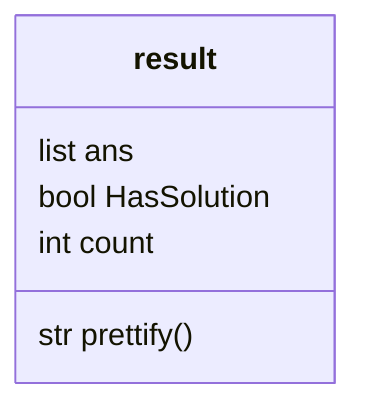
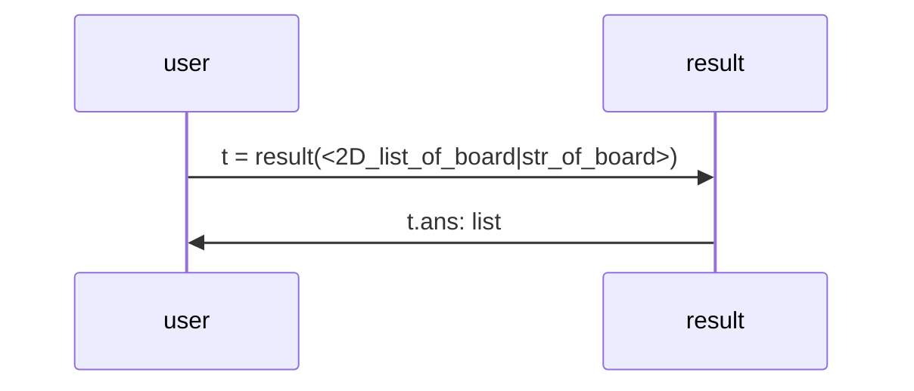
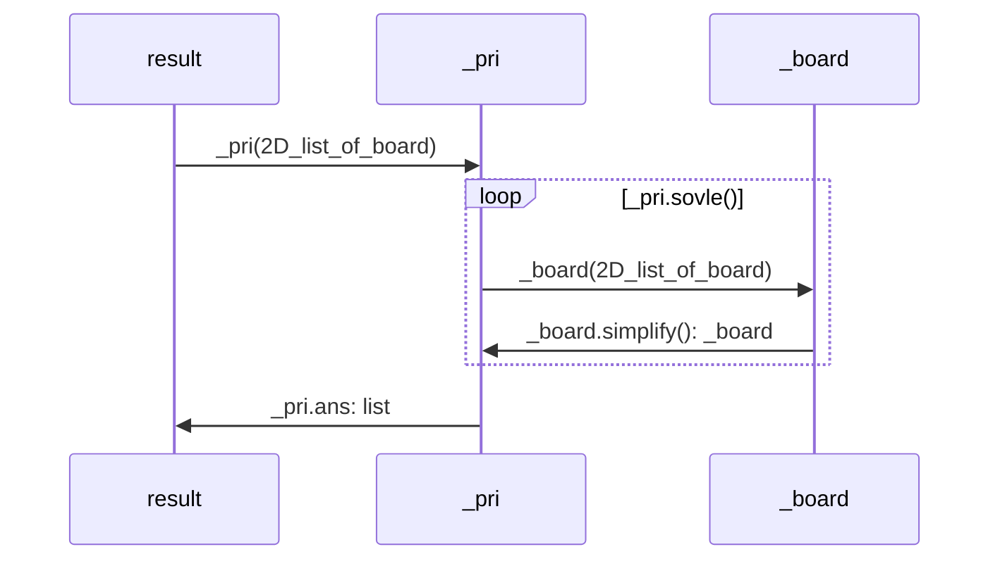
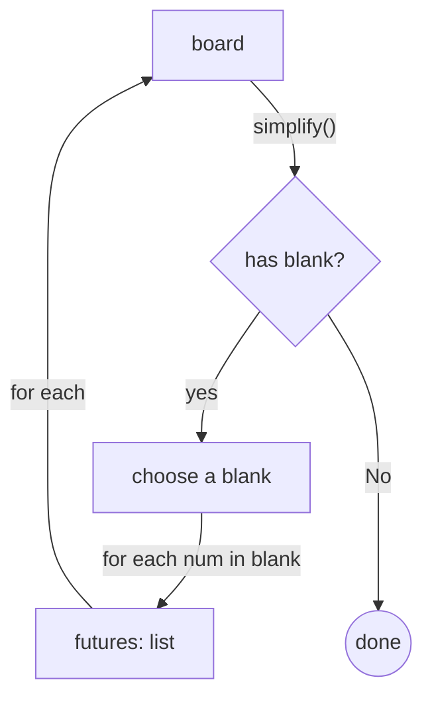

<h3>Main class</h3>

```mermaid
classDiagram
    class result {
        list ans
        bool HasSolution
        int count
        str prettify()
    }
```

<h3>Main usage</h3>

```mermaid
sequenceDiagram
    user->>result: t = result(<2D_list_of_board|str_of_board>)
    result->>user: t.ans: list

```

<h3>Mechanism</h3>

```mermaid
sequenceDiagram
    result->>_pri: _pri(2D_list_of_board)
    loop _pri.sovle()
        _pri->>_board: _board(2D_list_of_board)
        _board->>_pri: _board.simplify(): _board
    end
    _pri->>result: _pri.ans: list

```

<h3>_pri.sovle()</h3>

```mermaid
flowchart
    board -->|"simplify()"| a{has blank?}
    a --> |yes| b[choose a blank]
    b --> |for each num in blank| d[futures: list]
    d --> |for each| board
    a ---> |No| c((done))
```